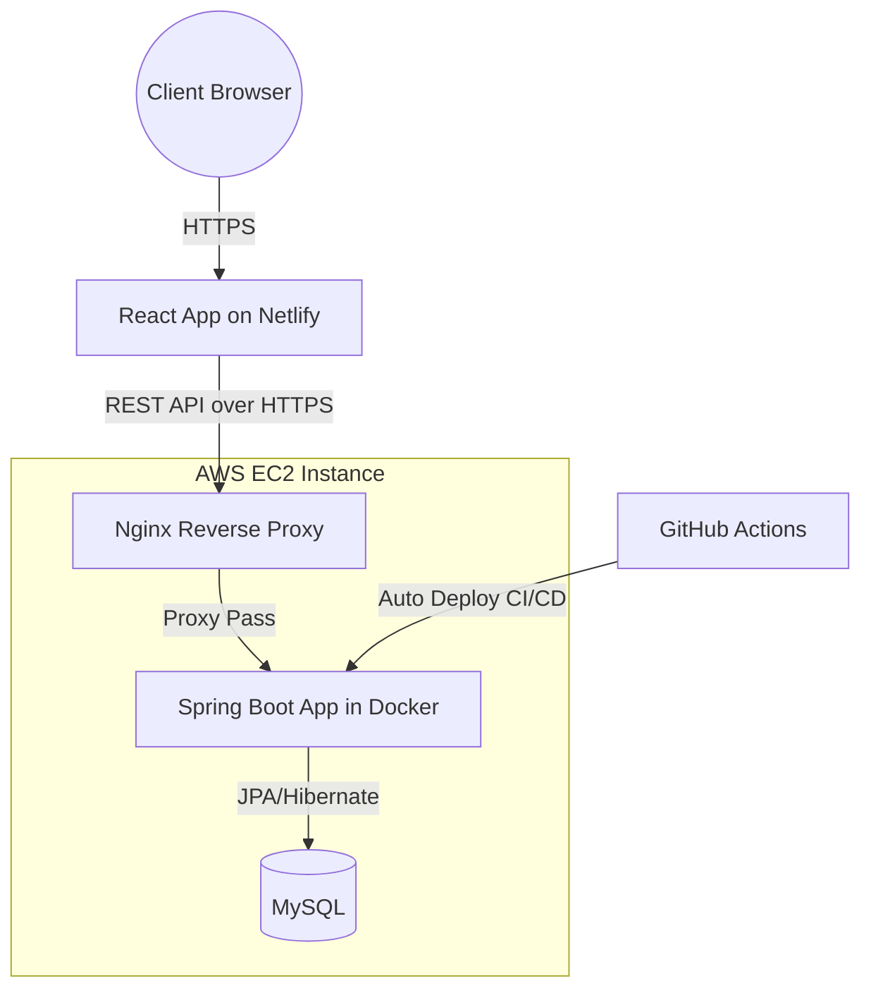

# Airline Booking Backend - Spring Boot API with Secure Authentication, Concurrency Handling and Docker-based Deployment on AWS

A production-style backend service for an airline booking system.

**Core value**:  
This project demonstrates how to build a reliable backend using Spring Boot, with Docker-based deployment on AWS EC2 and a GitHub Actions CI/CD pipeline. It focuses on API design, authentication, and handling real-world issues such as duplicate requests and concurrent bookings.

**Live Frontend**:  
https://airline-booking.menglanyan.dev

**Live Backend Swagger UI**:  
https://airline-api.menglanyan.dev/swagger-ui/index.html

**Frontend Repository**:  
https://github.com/menglanyan/airline-booking-system-frontend

---

## System Architecture


- **Security**: Nginx handles SSL termination, forwarding requests to the Spring Boot Docker container.
- **Containerization**: The Spring Boot API is fully containerized with Docker, ensuring consistency across environments.
- **Automation**: Any push to main branch triggers GitHub Actions to rebuild the Docker image and deploy it directly to AWS EC2, creating a simple automated delivery pipeline.

---

## Tech Stack

- Java 21 + Spring Boot
- Spring Security (JWT)
- JPA / Hibernate
- MySQL
- Docker & Docker Compose
- AWS EC2
- GitHub Actions (CI/CD)
- JUnit & Mockito
- Swagger / OpenAPI

---

## Backend Excellence

**Security and roles**  
- JWT-based authentication with Spring Security and role-based access control.

**Booking reliability**
- optimistic locking to reduce seat overbooking
- idempotent booking requests using Idempotency-Key

**API design**
- RESTful endpoints
- global exception handling using @ControllerAdvice
- consistent response format

---

## API Quick Reference

Full API:  
https://airline-api.menglanyan.dev/swagger-ui/index.html

**POST /api/bookings**

```json
{
  "flightId": 2,
  "passengers": [
    {
      "firstName": "Alice",
      "lastName": "Brown",
      "passportNumber": "P12345678",
      "type": "ADULT",
      "seatNumber": "12A",
      "specialRequest": ""
    }
  ]
}
```

---

## DevOps & Deployment

- Docker multi-stage build
- Deployed on AWS EC2
- Containerised MySQL database
- GitHub Actions CI/CD (build → push → deploy)
- Health checks via Actuator

---

## Testing

- Unit tests using JUnit and Mockito
- Focus on booking logic and validation

---

## How to Run

```bash
git clone https://github.com/menglanyan/airline-booking-system-backend.git
cd airline-booking-system-backend
docker-compose up --build
```
API runs on:
http://localhost:8082